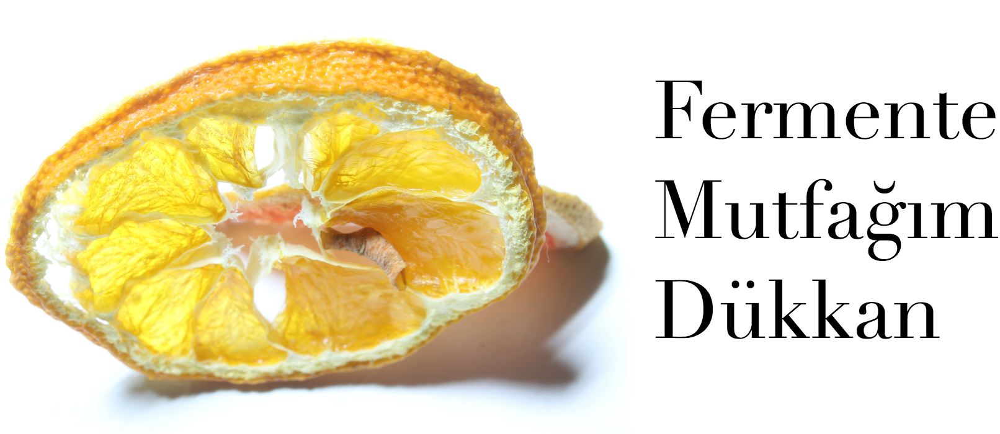
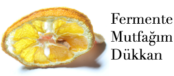
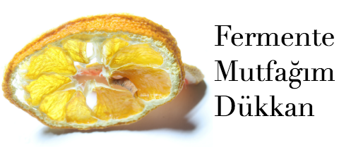
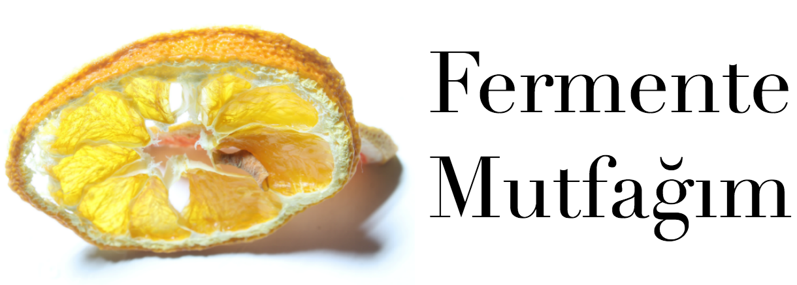
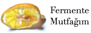
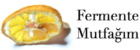
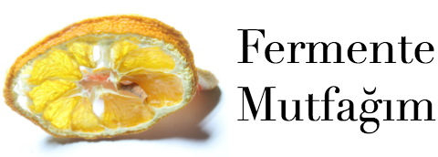
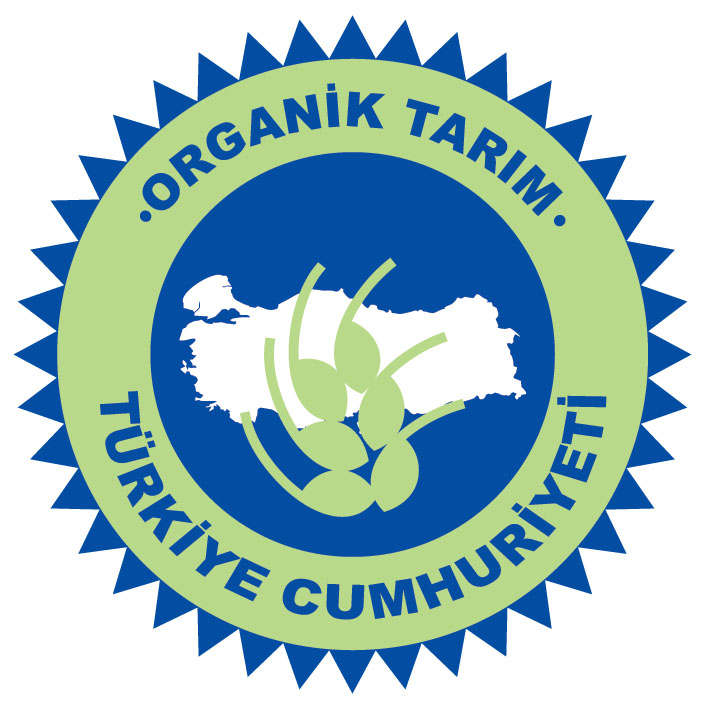

# Fermente Banner

Fermente Mutfağım resmi logosunun çeşitli boylarda versiyonları ve üretimleri
için gerekli kaynak dosyalar.

## Önizlemeler

### dukkan-1220_530

### dukkan-1612_700

### dukkan-180_79

### dukkan-240_105

### dukkan-240_97

### dukkan-360_157

### dukkan-360_157_v2

### dukkan-480_209

### dukkan-480_209_v2

### dukkan-480_209_v3

### dukkan-720_313

### mutfak-1220_437

### mutfak-180_65

### mutfak-240_86

### mutfak-360_129

### mutfak-480_172

### mutfak-720_258

### organiktarim

## Geliştirme

Herhangi bir yenilik yapıldığında `git tag` ile versiyonlayıp master branch'e
pushluyoruz.
